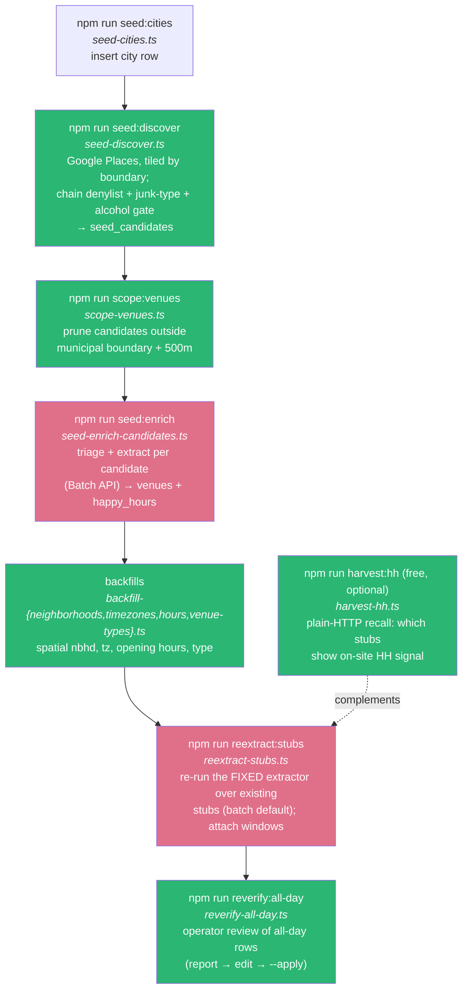
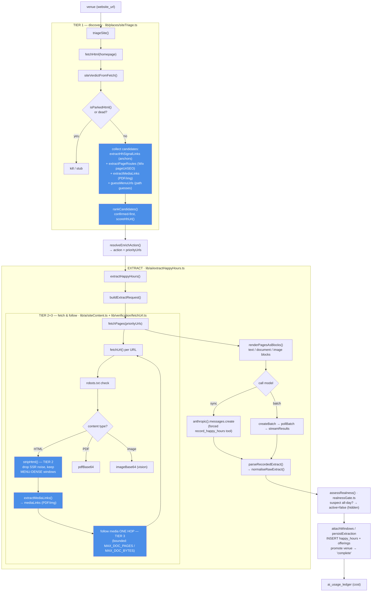

# Data pipeline — end-to-end flow

How venues get discovered and populated with happy-hour data, npm step by step, down
to the functions each one calls. (Open in VS Code with a Mermaid preview, or on GitHub,
to see these render as diagrams.)

---

## 1. The npm steps, in order



*(Pink = makes paid Anthropic calls; green = free / no model.)*

---

## 2. What happens INSIDE enrich / reextract (per venue)

This is the core loop `seed:enrich` and `reextract:stubs` share. Tiers 1–3 (discovery →
content → PDF/image) are the recall work we built; the realness gate + persist are the
write path.



---

## 3. Step → script → key functions

| npm step | script | key functions |
|---|---|---|
| `seed:discover` | `seed-discover.ts` | Places tiling, `chainDenylist`, boundary gate → `seed_candidates` |
| `scope:venues` | `scope-venues.ts` | `ST_Contains` boundary + 500m buffer prune |
| `seed:enrich` | `seed-enrich-candidates.ts` | `triageSite` → `resolveEnrichAction` → `buildExtractRequest`/`extractHappyHours` → `assessRealness` → `persistExtraction`; Batch via `createBatch/pollBatch/streamResults` |
| `reextract:stubs` | `reextract-stubs.ts` | same triage+extract over existing stubs; `attachWindows`, `persistResult`. Modes: batch (default), `--quick`, `--collect <batchId>`, `--venue --url` |
| `reverify:all-day` | `reverify-all-day.ts` | `reverifyAllDay` → report → `--apply` (audited) |
| `harvest:hh` | `harvest-hh.ts` | free recall: `hhLinks` + sitemap + `GUESS_PATHS`, `jsonLdHits`, `textSnippets` |
| backfills | `backfill-*.ts` | `assignNeighborhoods` (ST_DWithin), tz, opening hours, type map |

### The three recall tiers (what we built this session)
- **Tier 1 — discovery** (`siteTriage.ts`): anchor links + Wix `pageUriSEO` routes + PDF/image links + path guesses, ranked confirmed-first (`rankCandidates`/`scoreHhUrl`).
- **Tier 2 — content** (`fetchUrl.ts` `stripHtml`): strip SSR noise, keep menu-dense windows instead of truncating the first 8k.
- **Tier 3 — PDF/image** (`fetchUrl` + `siteContent.fetchPages`): fetch PDFs/images as document/vision blocks, and **follow media links one hop** under a payload budget. *This is what catches Bottega's menu PDF automatically.*

---

## 4. ASCII view (renders anywhere, no Mermaid needed)

### The npm pipeline, in order
```
 seed:cities ............... seed-cities.ts ............ insert city row
     │
     ▼
 seed:discover  (free) ..... seed-discover.ts ... Google Places, tiled by
     │                                                   boundary; chain denylist +
     │                                                   junk-type + alcohol gate
     │                                                   → seed_candidates
     ▼
 scope:venues  (free) ...... scope-venues.ts ........... prune candidates outside
     │                                                   boundary + 500m buffer
     ▼
 seed:enrich  ($ batch) .... seed-enrich-candidates.ts . triage + extract per
     │                                                   candidate → venues + happy_hours
     ▼
 backfill:*  (free) ........ backfill-{neighborhoods,timezones,hours,venue-types}.ts
     │
     ▼
 reextract:stubs ($ batch) . reextract-stubs.ts ........ re-run FIXED extractor over
     │                                                   EXISTING stubs; attach windows
     │            modes: (batch default) │ --quick │ --collect <id> │ --venue --url
     ▼
 reverify:all-day  ($) ..... reverify-all-day.ts ....... operator review of all-day
                                                         rows: report → edit → --apply

 harvest:hh (free, optional)  harvest-hh.ts ............ plain-HTTP recall (no model)
```

### Inside enrich / reextract — per venue, function by function
```
 venue (website_url)
   │
   ▼  ── TIER 1: DISCOVERY ──────────────────  lib/places/siteTriage.ts
  triageSite()
   └─ fetchHtml(homepage)
       └─ siteVerdictFromFetch()
           ├─ isParkedHtml() / dead?  ──────────────►  kill or stub  (stop)
           └─ gather candidate URLs (4 sources):
                • extractHhSignalLinks()  ... <a> anchor links
                • extractPageRoutes()     ... Wix "pageUriSEO" → finds /menu (unlinked!)
                • extractMediaLinks()     ... PDF / image menu links
                • guessMenuUrls()         ... /happy-hour, /menu, /menus, /bar-menu …
              → rankCandidates()          ... CONFIRMED-first, scored by scoreHhUrl()
   │
   ▼  resolveEnrichAction()  ──►  action + priorityUrls
   │
   ▼  ── EXTRACT ────────────────────────────  lib/ai/extractHappyHours.ts
  extractHappyHours()
   └─ buildExtractRequest()
       └─ fetchPages(priorityUrls)  ──────────  lib/ai/siteContent.ts
            └─ for each URL → fetchUrl()  ─────  lib/verification/fetchUrl.ts
                 ├─ robots.txt check
                 ├─ HTML  → stripHtml()   ◄── TIER 2: drop SSR noise, keep
                 │            │               MENU-DENSE windows (not first 8k)
                 │            └─ extractMediaLinks() → mediaLinks
                 ├─ PDF   → pdfBase64        (document block)
                 └─ image → imageBase64      (vision block)
            └─ FOLLOW mediaLinks ONE HOP  ◄── TIER 3  ← catches Bottega's menu PDF
                 bounded: MAX_DOC_PAGES=5 / MAX_DOC_BYTES=3MB
       └─ renderPagesAsBlocks()  ──►  text / document / image blocks
   └─ call the model:
        sync  → anthropic().messages.create   (forced record_happy_hours tool)
        batch → createBatch → pollBatch → streamResults
   └─ parseRecordedExtract() → normaliseRawExtract()  ──►  windows[]
   │
   ▼  ── REALNESS GATE ──────────────────────  lib/places/realnessGate.ts
  assessRealness(window)
   └─ suspect all-day?  ──►  active=false   (hidden from the site, NOT deleted)
   │
   ▼  ── PERSIST ─────────────────────────────  engine / attachWindows / persistResult
  INSERT happy_hours + offerings  ;  promote venue data_completeness → 'complete'
   │
   ▼  ai_usage_ledger  (records model cost)
```

### Bottega, traced (the win)
```
triageSite(bottega.com) → extractPageRoutes/guesses give /menu + /menus
fetchUrl(/menus) → HTML → extractMediaLinks() finds 6 menu PDFs
   → FOLLOW one hop → fetch the PDFs (budget keeps ~4 incl. the HH one)
model reads the PDF → "Happy Hour Tue–Sun 4–7 PM"
   → assessRealness OK → INSERT window → venue 'complete'   ✓ (conf 0.85, ~5¢)
```
